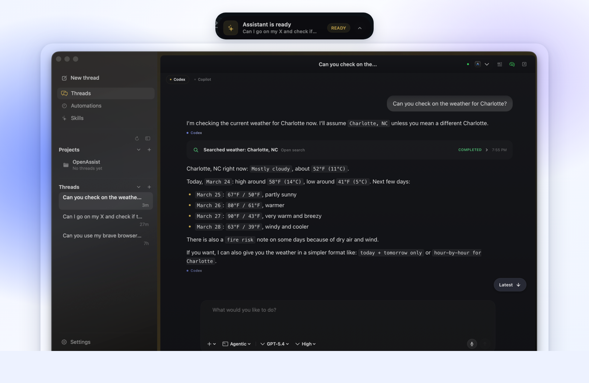
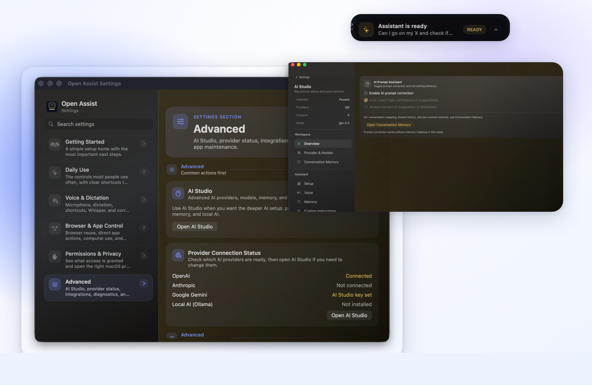
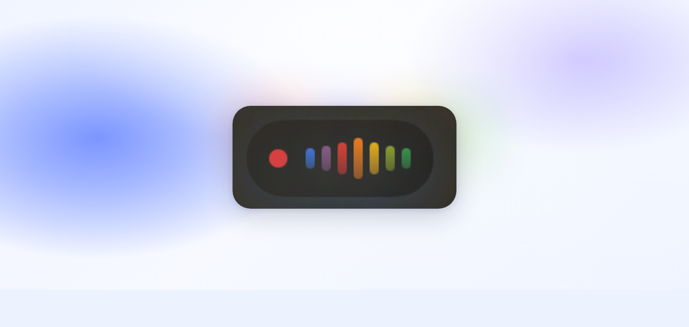

<p align="center">
  
</p>

<h1 align="center">Open Assist</h1>

<p align="center">
  An AI assistant for macOS with voice, local-first options, and approved automation.<br/>
  Use typed or spoken prompts, connect local or cloud models in AI Studio, and let the assistant take actions on your Mac.
</p>

<p align="center">
  <a href="https://github.com/manikv12/OpenAssist/releases"></a>
  
  
  
</p>

---

## Product Preview

<p align="center">
  
</p>

<p align="center">
  <sub>The real assistant workspace answering a weather request, with projects and threads on the left and the notch HUD ready above the app.</sub>
</p>

<p align="center">
  
</p>

<p align="center">
  <sub>Settings and AI Studio for provider setup, memory controls, advanced behavior, and the always-ready notch view.</sub>
</p>

<p align="center">
  
</p>

<p align="center">
  <sub>The voice transcription HUD, shown in the same quick-access style you use when speaking instead of typing.</sub>
</p>

## Why People Try Open Assist

If you want the short version, these are the features that usually make people interested:

- **Assistant-first workspace**: projects, threads, skills, attachments, checkpoints, and tool activity stay together in one clean window.
- **Voice built into the app**: use push-to-talk, dictation, or full live voice conversations when speaking is faster than typing.
- **Local or cloud AI**: run local models for privacy, or connect OpenAI, Anthropic, Gemini, Groq, OpenRouter, and more.
- **Safe action mode**: browser use, computer use, and app actions can work on your Mac, but the app pauses for approval before important steps.
- **Memory and recovery**: thread memory, project memory, AI memory review, and checkpoints help the assistant stay useful over time.
- **Recurring and remote workflows**: scheduled jobs and Telegram remote let the assistant keep helping even when you are away from your Mac.

## Open Assist At A Glance

Open Assist is a personal AI assistant for macOS.

It is built to help you do real work on your Mac:

- ask questions or give tasks with text or voice
- draft, rewrite, and polish text
- generate images through the assistant
- extend the assistant with custom skills
- keep using local models if you want more privacy
- use cloud models if you want faster setup or different capabilities
- let the assistant take approved actions in your browser or supported apps
- use voice capture and dictation when speaking is faster than typing
- schedule recurring automation jobs
- control the assistant remotely from Telegram
- checkpoint and restore conversations at any point

The menu bar is how you open it quickly. The assistant is the product.

---

## Three Ways To Use Open Assist

### 1. Ask

Use Open Assist like your everyday assistant.

You open the assistant, type or speak a request, and continue the conversation until the result is useful.

Common examples:

- "Summarize these notes."
- "Rewrite this message to sound more professional."
- "Help me plan my day."
- "Draft a reply to this email."
- "Generate an image of a sunset over mountains."

The assistant supports two interaction modes:

- **Plan mode**: the assistant analyzes tasks and proposes a plan before acting.
- **Agentic mode**: the assistant executes actions directly with your approval.

You can also adjust the reasoning effort level to balance speed and thoroughness.

### 2. Speak

Use voice when talking is faster than typing.

Open Assist can:

- take a spoken assistant task
- transcribe speech into your current app
- hold a live voice conversation with the assistant
- keep recent transcript history
- let you paste your last transcript again

Three speech engines are available:

- **Apple Speech** for the fastest setup (on-device and cloud modes)
- **Whisper.cpp** for local offline transcription with Core ML acceleration
- **Cloud providers** for services like OpenAI, Groq, Deepgram, or Gemini

This is useful when you want fast text input without switching apps.

### 3. Act

Use Open Assist in agentic mode when you want it to do work on your Mac with your approval.

It can help with:

- browser tasks using your signed-in local browser profile (Chrome, Brave, Edge)
- computer use actions via screenshots and mouse/keyboard control
- direct app actions in Finder, Terminal, Calendar, System Settings, Reminders, Contacts, Notes, and Messages

Examples:

- "Open my project board in Chrome."
- "Reveal the Downloads folder in Finder."
- "Create a calendar event draft for tomorrow at 3 PM."
- "Take a screenshot and click the submit button."

---

## Full Feature Breakdown

### Skills

Extend what the assistant can do with reusable skills.

- **Built-in skills** ship with the app and cover common tasks.
- **Custom skills** can be created through the skill wizard with a name, description, example requests, and optional reference files.
- **Imported skills** can be loaded from local folders or GitHub repositories.
- Skills are attached per conversation thread, so different threads can use different skill sets.
- Browse and manage skills from the sidebar skills library.

### Projects

Organize your work into projects.

- Create projects with custom names, icons, and linked folders.
- Conversations are grouped under projects for easy navigation.
- Each project builds its own memory from the threads inside it.
- Archive projects when you are done with them.

### Conversation Checkpoints

Save and restore conversation state at any point.

- Checkpoints capture the full conversation snapshot.
- Git-based code checkpoints track file changes made during a session.
- Rewind to an earlier checkpoint to try a different approach.
- Checkpoint cards appear inline in the chat for easy navigation.

### Image Generation

Generate images directly from the assistant.

- Uses Google Gemini via the Google AI Studio API.
- Ask the assistant to create, modify, or describe images.
- Configure the model and API key in settings.

### Memory

Open Assist learns from your conversations over time.

- **Thread memory** keeps per-conversation context.
- **Long-term memory** persists across sessions with semantic ranking.
- **Project memory** aggregates lessons from multiple threads.
- **Memory suggestions** surface patterns and lessons for your review.
- **AI Memory Studio** lets you browse, search, and manage indexed memories.

Memory indexing is behind the `OPENASSIST_FEATURE_AI_MEMORY=1` feature flag.

### Prompt Rewriting

Rewrite and polish text with AI assistance.

- Multiple provider support (OpenAI, Gemini, Groq, Anthropic, OpenRouter, Ollama).
- Style presets: Balanced, Formal, Casual, Architect, Senior Developer.
- Custom rewrite instructions.
- Works from the compact HUD or the full assistant window.

### Scheduled Jobs

Automate recurring tasks on a schedule.

- Create jobs with full cron expression support.
- Enable or disable jobs without deleting them.
- Monitor job status, execution history, and failures.
- A built-in watchdog detects stuck automation runs.

### Telegram Remote Control

Control Open Assist from your phone via a Telegram bot.

- Pair the bot with a token and secure owner verification.
- Commands: `/start`, `/new`, `/projects`, `/sessions`, `/backend`, `/models`, `/mode`, `/effort`, `/usage`, `/status`, `/stop`
- Browse projects and threads, switch models and backends, and adjust reasoning effort.
- Send text, voice messages, images, and audio files to the assistant.
- Receive formatted responses with code blocks and progress updates.

### Workspace Integration

Open files from assistant context in your preferred editor.

- Supported editors: VS Code, Cursor, Windsurf, Xcode, Android Studio, Terminal, and Finder.
- Quick launch buttons remember your preferred editor.
- Link project folders for file-aware context.

### Compact HUD

A minimal floating interface for quick interactions.

- **Orb mode**: a small floating icon showing assistant status.
- **Expanded mode**: a panel with conversation history and controls.
- Push-to-talk controls work from the HUD.
- Status visualization: idle, listening, thinking, acting, streaming, failed.

### Completion Notifications

Get notified when long-running tasks finish.

- macOS notification center integration.
- Notifications are deduplicated within configurable time windows.
- Grouped by session for easy tracking.

---

## Setup In 5 Minutes

If you want the main product experience, start here.

1. Download the latest release from [GitHub Releases](https://github.com/manikv12/OpenAssist/releases).
2. Open `Open Assist.app`.
3. Open **Settings -> AI & Models -> AI Studio**.
4. Connect a cloud provider or set up local AI.
5. Open the assistant and try a simple request.

Example first prompt:

- "Help me write a short update for my team."

### Choose the setup you need

| Goal | Open this | What to do |
|---|---|---|
| Use the assistant | `Settings -> AI & Models` and `AI Studio` | Connect a provider, choose a model, and start chatting. |
| Speak to the assistant or dictate text | `Settings -> Speech & Input` | Pick a speech engine and grant the needed permissions. |
| Let the assistant control browser or apps | `Settings -> Automation` | Allow `Automation / Apple Events` and choose a browser profile if needed. |
| Schedule recurring tasks | `Settings -> Scheduled Jobs` | Create a job with a cron schedule and a prompt. |
| Control from Telegram | `Settings -> Telegram` | Enter your bot token and pair the bot. |

---

## How To Set Up Open Assist

### 1. Assistant setup

This is the most important setup.

1. Open **Settings -> AI & Models**.
2. Open **AI Studio**.
3. Choose how you want to run AI:
   - local AI through Ollama or the built-in local AI setup flow
   - or a cloud provider such as OpenAI, Anthropic, Gemini, Groq, or OpenRouter
4. Choose a model.
5. Save your API key or finish OAuth sign-in if your provider needs it.
6. Open the assistant and test a real request.

Simple examples:

- If you want local AI and no API key, start with the local AI setup in **AI Studio**.
- If you already use OpenAI or Anthropic, connect that provider and pick your preferred model.

#### Runtime backends

Open Assist supports multiple runtime backends:

- **Codex**: the primary backend using OpenAI models.
- **GitHub Copilot**: an alternative backend with GitHub authentication.

You can switch backends in settings or remotely via Telegram.

### 2. Voice and dictation setup

Set this up if you want spoken prompts or speech-to-text.

1. Grant **Microphone** when macOS asks.
2. If you want to use **Apple Speech**, also grant **Speech Recognition**.
3. If you want direct insertion and reliable global shortcuts, grant **Accessibility**.
4. Open **Settings -> Speech & Input**.
5. Choose your speech engine:
   - `Apple Speech` for the fastest setup
   - `Whisper.cpp` for local transcription after model install
   - `Cloud Providers` for services like OpenAI, Groq, Deepgram, or Gemini
6. If you choose **Whisper.cpp**, open **Whisper Model Install** and:
   - download a model such as `tiny`, `base`, or `small`
   - pick the active model
   - optionally enable Core ML if your Mac supports it
7. Test a voice shortcut or speak a task to the assistant.

### 3. Automation setup

Set this up if you want the assistant to take actions on your Mac.

1. Open **Settings -> Automation**.
2. Allow **Automation / Apple Events** when macOS prompts you.
3. If you want browser control, choose a profile for Google Chrome, Brave, or Microsoft Edge.
4. If you want computer use (screenshot-based actions), grant **Screen Recording**.
5. Open the assistant in **Agentic** mode and try a simple task.

Simple examples:

- "Open Bluetooth settings."
- "Show my Downloads folder."
- "Create a reminder for tomorrow."

### 4. Skills setup

Set this up if you want to extend the assistant with custom capabilities.

1. Open the sidebar and go to the **Skills** pane.
2. Browse built-in skills or create a new one with the skill wizard.
3. To import a skill from GitHub, use the format `owner/repo/path@branch`.
4. Attach skills to individual conversation threads as needed.

### 5. Telegram setup

Set this up if you want to control the assistant from your phone.

1. Create a Telegram bot via [@BotFather](https://t.me/botfather) and copy the token.
2. Open **Settings -> Telegram**.
3. Enter the bot token.
4. Send `/start` to your bot in Telegram to pair it.

---

## How To Use Open Assist Day To Day

### For normal assistant tasks

1. Open Open Assist from the menu bar.
2. Choose **Open Assistant** or a voice-first entry point.
3. Type or speak your request.
4. Review the result.
5. Ask a follow-up if you want to refine it.

### For quick dictation

1. Click into any text field.
2. Hold `Option + Command + Space`.
3. Speak naturally.
4. Release to insert text.

### For live voice conversations

1. Open the assistant or the compact HUD.
2. Start a voice session.
3. Speak naturally and the assistant will respond with audio.
4. The conversation continues hands-free until you stop it.

### For automation tasks

1. Open the assistant in **Agentic** mode.
2. Ask for the task in simple words.
3. Approve the action if Open Assist asks.
4. Review the result.

### For scheduled automation

1. Open **Settings -> Scheduled Jobs**.
2. Create a new job with a cron schedule and a prompt.
3. Enable the job.
4. The assistant will run the task on schedule and notify you when it completes.

---

## Default Shortcuts

| Action | Default shortcut |
|---|---|
| Hold-to-talk | `Option + Command + Space` (`⌥⌘Space`) |
| Toggle continuous dictation | `Control + Option + Command + Space` (`⌃⌥⌘Space`) |
| Paste last transcript | `Option + Command + V` (`⌥⌘V`) |

You can change all shortcuts in Settings.

---

## Requirements And Permissions

### System requirements

- macOS 13.3 or newer

### Permissions by feature

- **Microphone**: needed for spoken assistant tasks and dictation
- **Accessibility**: needed for direct insertion, reliable global shortcuts, and computer use click/type actions
- **Screen Recording**: needed for computer use screenshot-based automation
- **Speech Recognition**: only needed for the Apple Speech engine
- **Automation / Apple Events**: needed for browser or direct app actions
- **Full Disk Access**: only needed if the assistant accesses protected files or folders

Typed assistant use can work without microphone or dictation setup.

### Internet is only needed for some features

- cloud AI providers
- cloud transcription
- downloading `whisper.cpp` models
- local AI runtime/model setup
- app update checks
- Telegram remote control
- GitHub Copilot authentication

---

## Privacy Notes

- No account is required for local use
- No telemetry is enabled by default
- Settings, transcript history, and learned corrections stay on your Mac
- API keys and OAuth sessions are stored in macOS Keychain
- If you choose cloud providers, your audio or text is sent to that provider
- Clipboard copying is off by default to reduce clipboard history leakage
- Memory data is stored locally on your Mac

---

## Build From Source

Use this if you want to run or modify the project yourself.

### Prerequisites

- Xcode 15+ or Apple developer tools with Swift 5.9 support
- macOS 13.3 or newer
- Node/npm only if you want to make a DMG with `--make-dmg`
- A Developer ID certificate and Apple notarization credentials only if you want a public signed build

### Main build

```bash
./build.sh
```

This creates:

- `dist/Open Assist.app`

Run it with:

```bash
open "dist/Open Assist.app"
```

What `build.sh` does:

- downloads `Vendor/Whisper/whisper.xcframework` automatically if it is missing
- runs `swift build -c release`
- bundles the app into `dist/Open Assist.app`
- uses ad-hoc signing by default unless `DEVELOPER_ID` is set

### Useful build options

```bash
./build.sh --install
./build.sh --make-dmg
```

- `--install` copies the app to `/Applications/Open Assist.app`
- `--make-dmg` also creates `dist/Open Assist.dmg`
- `--install` resets Accessibility and Automation permissions, so macOS will ask again later

### Signed distribution build

If you have a Developer ID certificate and want a signed DMG:

```bash
export DEVELOPER_ID="Your Name (TEAMID)"
./build.sh --make-dmg
Scripts/notarize.sh
```

`Scripts/notarize.sh` expects these environment variables:

- `APPLE_ID`
- `APPLE_TEAM_ID`
- `APPLE_APP_PASSWORD`

There is also a repo-specific convenience helper:

```bash
./build-local.sh --make-dmg
```

Use that helper only if the signing identity inside the script matches your machine.

---

## Tests

Run package tests:

```bash
swift test
```

Run the smoke and regression scripts:

```bash
Scripts/run-tests.sh
```

Run insertion reliability checks directly:

```bash
Scripts/run-insertion-reliability.sh --regression
```

The repository also includes `XCTest` coverage in `Tests/OpenAssistTests/`.

---

## Diagnostics And Troubleshooting

If text insertion is not working the way you expect:

- turn on insertion diagnostics in app settings, or set `OPENASSIST_INSERTION_DIAGNOSTICS=1`
- default log path: `/tmp/openassist-insertion-diagnostics.log`
- optional custom log path: `OPENASSIST_INSERTION_DIAGNOSTICS_PATH`

Crash logs, when present, are stored at:

- `~/Library/Logs/OpenAssist/crash.log`

If you need more help:

- Start with the [User Guide](Docs/User-Guide.md)
- See the [Quick Start wiki](Wiki/Quick-Start.md)
- Check the [Troubleshooting wiki](Wiki/Troubleshooting.md)

---

## Repo Layout

```text
Sources/OpenAssist/       Main app code
Sources/OpenAssistObjCInterop/ Objective-C interop helpers
Resources/               Info.plist, icons, entitlements
Scripts/                 Build, test, release, and utility scripts
Tests/OpenAssistTests/   XCTest coverage
Docs/                    User-facing docs
Wiki/                    Extra product notes
Vendor/Whisper/          Bundled whisper.cpp XCFramework
web/chat/                React chat UI (rendered in assistant window)
```

Useful places to start:

- `Sources/OpenAssist/App.swift`: app lifecycle, windows, and app-level wiring
- `Sources/OpenAssist/Services/`: transcription, insertion, AI, settings, and automation logic
- `Sources/OpenAssist/Views/`: SwiftUI views such as Settings and AI Studio
- `Sources/OpenAssist/Assistant/`: assistant workflows, skills, sessions, and automation behavior

## Advanced Notes

- AI memory indexing is behind the `OPENASSIST_FEATURE_AI_MEMORY=1` feature flag.
- Additional feature flags: `OPENASSIST_FEATURE_CONVERSATION_LONG_TERM_MEMORY`, `OPENASSIST_FEATURE_CROSS_IDE_CONVERSATION_SHARING`, `OPENASSIST_FEATURE_PERSONAL_ASSISTANT`.
- The main product story is assistant first, while voice, dictation, and automation are important supporting features.

---

## More Docs

- [User Guide](Docs/User-Guide.md)
- [Wiki Home](Wiki/Home.md)
- [Quick Start Wiki](Wiki/Quick-Start.md)
- [Why Open Assist](Wiki/Why-OpenAssist.md)
- [Privacy-First Design](Wiki/Privacy-First-Design.md)
