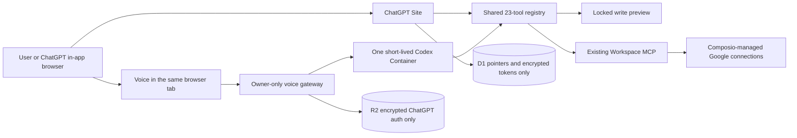

# OpenAssist Daily Workspace Architecture

The Daily Workspace is a visible web dashboard for OpenAssist Workspace. It keeps the public challenge demo separate from the owner's private Google data.

## Two separate modes

- **Demo mode** is public and uses synthetic mail, tasks, events, notes, memory, and accounts.
- **Live mode** is owner-only. It reads and writes through the existing Workspace MCP.
- Demo executors never call the live MCP. Live routes require the owner role.

## Shared WebMCP tools

ChatGPT WebMCP and the voice agent use one shared contract covering accounts, daily brief, Gmail, Tasks, Calendar, notes, memory, and visible navigation. Read tools carry `readOnlyHint`. Tools that return Google or website text carry `untrustedContentHint`.

## Safe writes

1. A requested write creates a visible preview.
2. The server signs the exact tool, exact arguments hash, user, random nonce, and two-minute expiration.
3. The user taps **Approve**, or says **confirm** for a non-destructive preview while it is still open.
4. Delete, trash, and forget always require an on-screen tap.
5. The approved action executes once with an idempotency hash.
6. The saved item is read back and the verified result is shown.
7. Failed writes are never retried silently.

Email, attachment, Drive, website, and tool-result text can never approve or trigger another action.

## Storage boundaries

D1 contains only:

- Stable Site user ID and role.
- Encrypted Workspace access and refresh tokens, expiration, scope, and revision.
- Display preferences.
- Voice authentication pointer, status, and revision.
- One-way idempotency hashes with short expiration.

D1 and server logs do not contain Google messages, Gmail IDs, attachments, task text, calendar text, notes, memory text, audio, or voice transcripts.

R2 contains only the AES-GCM encrypted ChatGPT subscription authentication file for the owner. The key stays in the Worker. Disconnect deletes the object, runs Codex logout, and stops the Container.

## Voice compatibility gate

- One `basic` Cloudflare Container is allowed.
- It stops after 15 idle minutes.
- The user is warned after 25 minutes and the voice session stops after 30 minutes.
- ChatGPT device sign-in is forced. API-key variables are removed and no paid fallback exists.
- The Container has an empty workspace, read-only sandbox, no remote Mac, no computer control, no plugin tools, and one visible Site bridge.
- Codex `0.150.1` is pinned.
- The release check rejects `session.model` and any realtime request that sends `model`.
- Public release remains blocked until a real owner microphone → transcript → site tool → visible update → spoken response canary passes with API-key variables removed.

## External systems that stay unchanged

- Existing Google OAuth scopes are unchanged.
- Composio remains the manager of Google service credentials.
- Google verification and the existing OpenAI app review remain separate from this WebMCP challenge project.
