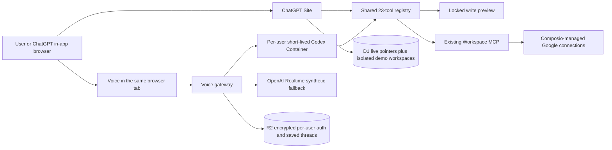

# OpenAssist Daily Workspace Architecture

The Daily Workspace is a visible web dashboard for OpenAssist Workspace. It keeps the public challenge demo separate from the owner's private Google data.

## Two separate modes

- **Demo mode** is public. Each visitor receives a separate synthetic workspace in D1 that expires after 24 hours and can be reset at any time.
- **Live mode** is owner-only. It reads and writes through the existing Workspace MCP.
- Demo executors never call the live MCP. Live routes require the owner role.
- Demo edits and WebMCP actions operate on the same stored workspace, so judges can see and manipulate their own data without connecting Google.

## Shared WebMCP tools

ChatGPT WebMCP and the voice agent use one shared contract covering accounts, daily brief, Gmail, Tasks, Calendar, notes, memory, and visible navigation. Read tools carry `readOnlyHint`. Tools that return Google or website text carry `untrustedContentHint`.

## Safe writes

1. A requested write creates a visible preview.
2. The server signs the exact tool, exact arguments hash, user, random nonce, and two-minute expiration.
3. The user taps **Approve**, or says **confirm** for a non-destructive preview while it is still open.
4. Delete, trash, and forget always require an on-screen tap.
5. The approved action executes once with an idempotency hash.
6. The saved item is read back and the verified result is shown.
7. Failed writes are never retried silently.

Email, attachment, Drive, website, and tool-result text can never approve or trigger another action.

## Storage boundaries

D1 contains two deliberately separate kinds of records.

Live records contain only:

- Stable Site user ID and role.
- Encrypted Workspace access and refresh tokens, expiration, scope, and revision.
- Display preferences.
- Voice authentication pointer, status, and revision.
- One-way idempotency hashes with short expiration.
- One-way judge-session hashes, session mode, status, timestamps, safe error class, and tool-call count for owner monitoring.

Demo records contain only clearly labelled synthetic accounts, mail, tasks, events, notes, memory, and activity for that visitor's temporary workspace. They have no Google identifiers or credentials, expire after 24 hours, and are deleted on reset.

D1 and server logs do not contain any real Google messages, Gmail IDs, attachments, task text, calendar text, notes, memory text, audio, voice transcripts, prompts, or voice tool arguments.

R2 contains only AES-GCM encrypted ChatGPT subscription authentication and saved Codex thread files, separated by an opaque visitor hash. The key stays in the Worker. Disconnect deletes that visitor's objects, runs Codex logout, and stops only that visitor's Container.

## Voice compatibility gate

- Each subscription user receives a separate `basic` Cloudflare Container; at most 10 can be active.
- It stops after 15 idle minutes.
- The user is warned after 25 minutes and the voice session stops after 30 minutes.
- ChatGPT device sign-in is forced inside Containers. API-key variables are removed from Containers.
- The funded key is encrypted in private R2 and used only by the Worker. The owner can pause it and set bounded daily session, time, and tool-call limits. It can execute only the visible synthetic tool registry.
- The Container has an empty workspace, read-only sandbox, no remote Mac, no computer control, no plugin tools, and one visible Site bridge.
- Codex `0.150.1` is pinned.
- The release check rejects `session.model` and any realtime request that sends `model`.
- Subscription voice remains gated by a real microphone → transcript → site tool → visible update → spoken response canary with API-key variables removed from the Container.

## External systems that stay unchanged

- Existing Google OAuth scopes are unchanged.
- Composio remains the manager of Google service credentials.
- Google verification and the existing OpenAI app review remain separate from this WebMCP challenge project.
